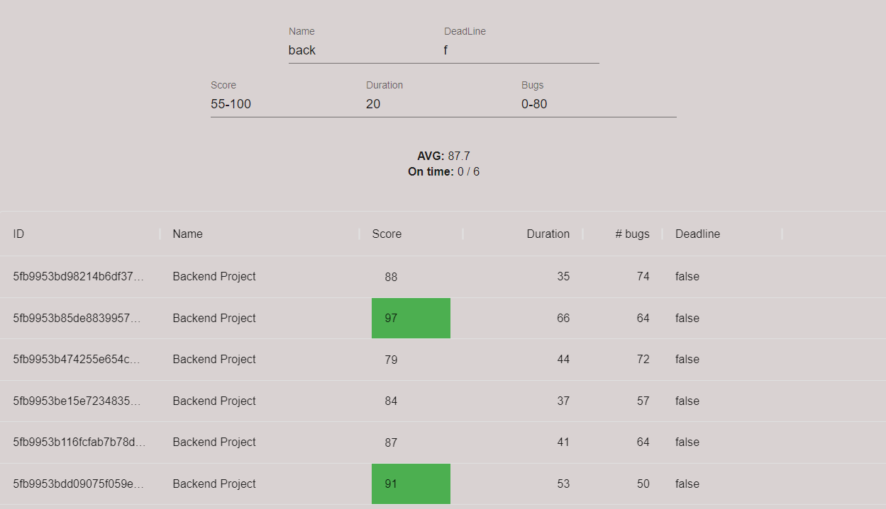

# Loggin App

This is Loggin App, written with React Typescript!

In order to login make sure

- Enter valid email
- Password must be at length of minimum 8, and contain 1 Upper case and 1 digit at least.

## Installation

- git clone https://github.com/Arielegend/loginAPP.git
- cd loginAPP
- npm i
- npm start

## Usage

Once Successfuly loggin, you will be redirected to '/info'

Here you can Filter data as you wish!

- Filter by name
  - NOT case sensitive
- Filter by DeadLine
  - Simply enter "False" or "True" (may also put "f" or "t")
  - NOT case sensitive
- Filter by Score / Duration / Bugs using:
  - number => Will display all rows, with corresponding field higher or equal to number
  - number1-number2 => Will display all rows, with corresponding field in range of [number1 , number2]
    - In case you choose to filter by range, make sure to have no spaces

 
## Example
Following example shows all projects filtered by: 
1. name "back"
2. Failed Deadline
3. Score between 55-100
4. Duration at least 20 (days)
5. Bugs at most 80

Made with <3

